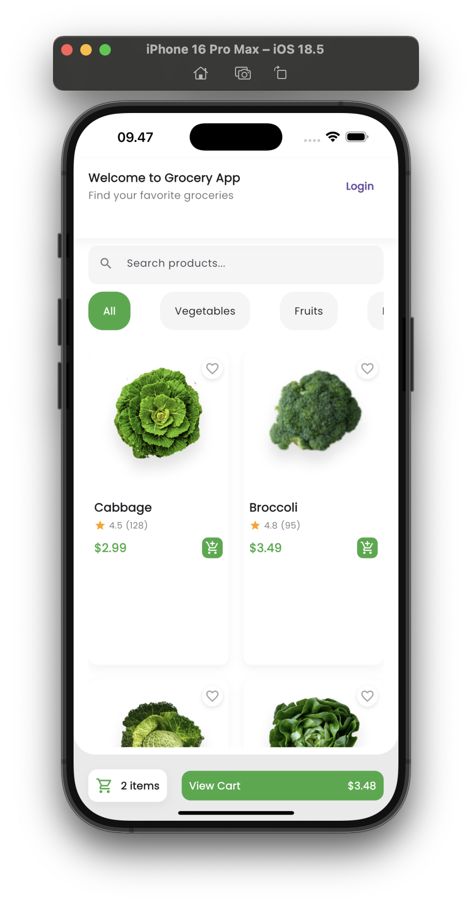
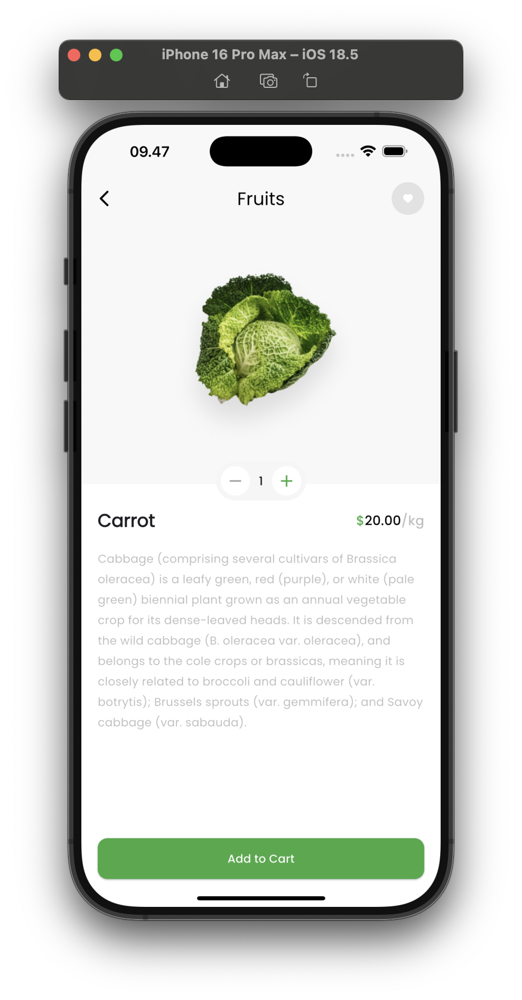
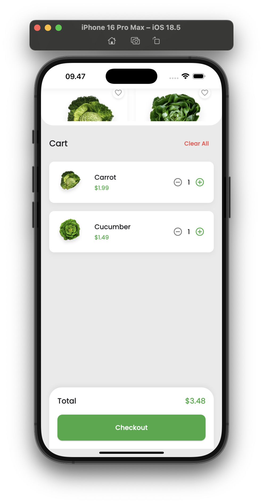

## 📱 Project Overview

FreshCart is a modern, user-friendly grocery shopping application built with Flutter. It provides an intuitive interface for users to browse, search, and manage their grocery shopping experience with a focus on visual appeal and smooth user interaction. The app combines beautiful design with practical functionality to create an enjoyable shopping experience.

## 🎯 Problem Statement

Traditional grocery shopping apps often suffer from:

- Cluttered and confusing interfaces
- Poor navigation and user experience
- Lack of visual appeal and modern design
- Inefficient product browsing and searching
- Complicated checkout processes

FreshCart addresses these issues by providing:

- Clean, modern, and intuitive shopping experience
- Streamlined navigation and user flow
- Visually appealing product presentation
- Efficient search and filtering capabilities
- Simplified checkout process

## 👥 Target Users / Use Cases

- **Daily Grocery Shoppers**

  - Looking for a streamlined shopping experience
  - Need quick access to frequently bought items
  - Value time-saving features

- **Busy Professionals**

  - Require efficient shopping solutions
  - Need quick order placement
  - Appreciate saved shopping lists

- **Home Cooks**

  - Want to organize shopping lists
  - Need detailed product information
  - Value recipe integration

- **Visual-First Shoppers**
  - Prefer image-based browsing
  - Appreciate high-quality product photos
  - Value intuitive UI/UX

## 🛠️ Tech Stack

- **Framework & Language**

  - Flutter (^3.8.0)
  - Dart

- **UI Components**

  - Google Fonts
  - Carousel Slider
  - Flutter SpinKit
  - Custom animations and transitions

- **State Management**
  - Provider pattern
  - Local state management

**Tags**: #Flutter #MobileApp #UI/UX #GroceryShopping #CrossPlatform #ModernUI

## 📂 Project Structure

```
lib/
├── components/     # Reusable UI components
│   ├── buttons/
│   ├── cards/
│   └── inputs/
├── controllers/    # Business logic and state management
├── models/        # Data models and structures
├── pages/         # Main application screens
│   ├── home/
│   ├── cart/
│   └── detail/
└── widgets/       # Custom widgets
    ├── product_card/
    └── category_list/
```

## ✨ Key Features

- **Modern UI/UX**

  - Clean and intuitive interface
  - Smooth animations and transitions
  - Responsive design for various screen sizes
  - Dark/Light theme support

- **Shopping Experience**

  - Image carousel for featured items
  - Product categorization
  - Search functionality
  - Shopping cart management

- **Technical Features**
  - Custom loading animations
  - SVG icon support
  - Google Fonts integration
  - Efficient asset management

## 📸 Screenshots

| Home Screen                            | Detail Screen                              | Cart Screen                            |
| -------------------------------------- | ------------------------------------------ | -------------------------------------- |
|  |  |  |

## 🔄 Data Source & Preprocessing

- **Asset Management**

  - Organized image assets
  - Optimized icon sets
  - Efficient resource loading

- **Data Generation**
  - Faker package for sample data
  - Structured product models
  - Category management

## 🚧 Challenges & Solutions

| Challenge                      | Solution                                                    |
| ------------------------------ | ----------------------------------------------------------- |
| Creating smooth, responsive UI | Implemented custom widgets and optimized Flutter rendering  |
| Managing assets efficiently    | Organized asset structure and proper asset declarations     |
| Cross-platform consistency     | Used Flutter's platform-agnostic widgets and custom styling |
| Performance optimization       | Implemented efficient state management and lazy loading     |

## 🚀 Installation & Setup Guide

1. **Prerequisites**

   - Flutter SDK (version ^3.8.0)
   - Dart SDK
   - Android Studio / VS Code
   - Git

2. **Setup Steps**

   ```bash
   # Clone the repository
   git clone https://github.com/rizky28eka/freshcart.git

   # Navigate to project directory
   cd freshcart

   # Install dependencies
   flutter pub get

   # Run the app
   flutter run
   ```

3. **Development**
   - Use `flutter run` for development
   - Use `flutter build` for production builds
   - Run tests with `flutter test`

## 🔮 Future Improvements

- [ ] Backend integration
- [ ] User authentication system
- [ ] Advanced shopping cart functionality
- [ ] Order tracking system
- [ ] Push notifications
- [ ] Offline support
- [ ] Payment gateway integration
- [ ] Social sharing features
- [ ] Wishlist functionality
- [ ] Product reviews and ratings

## 📚 Lessons Learned

- **Asset Management**

  - Importance of proper asset organization
  - Optimization techniques for images
  - Efficient resource loading

- **Development**
  - Best practices for widget composition
  - Performance optimization techniques
  - State management considerations
  - Cross-platform UI consistency

## 🙏 Credits / Acknowledgments

- Flutter team for the amazing framework
- Google Fonts for typography
- Flutter SpinKit for loading animations
- Carousel Slider package contributors
- All open-source contributors

## 📄 License

This project is licensed under the MIT License - see the [LICENSE](LICENSE) file for details.

## 🤝 Contributing

Contributions are welcome! Please feel free to submit a Pull Request.

1. Fork the repository
2. Create your feature branch (`git checkout -b feature/AmazingFeature`)
3. Commit your changes (`git commit -m 'Add some AmazingFeature'`)
4. Push to the branch (`git push origin feature/AmazingFeature`)
5. Open a Pull Request
