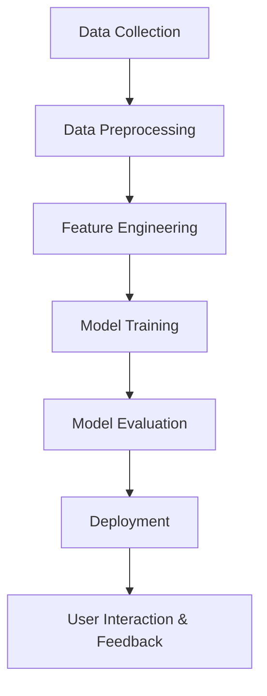

## Project Overview

TremorTrack 2.0 is an advanced, interactive web application designed to predict earthquake magnitudes and visualize seismic data using state-of-the-art machine learning and data visualization techniques. The platform empowers seismologists, emergency managers, and researchers to make data-driven decisions and gain deeper insights into earthquake phenomena.

## Problem Statement

Accurately predicting earthquake magnitudes and understanding their impact is a persistent challenge in seismology. Traditional methods often lack real-time predictive capabilities and comprehensive visualization, limiting their utility for rapid response and scientific analysis. TremorTrack 2.0 addresses this gap by providing an automated, user-friendly tool for magnitude prediction and seismic data exploration.

## Target Users / Use Cases

- **Seismologists & Researchers**: For rapid earthquake analysis and hypothesis testing.
- **Disaster Management Agencies**: To support emergency preparedness and response planning.
- **Educators & Students**: As an interactive learning tool for earthquake science.
- **Developers & Data Scientists**: As a reference for building predictive analytics in geoscience.

## Tech Stack

- **Programming Language**: Python 3.x
- **:Web Framework**: Streamlit
- **:Data Processing**: pandas, numpy
- **:Machine Learning**: scikit-learn (Random Forest)
- **:Visualization**: Plotly
- **:Model & Data Handling**: joblib, gdown
- **:Deployment**: Local or cloud (Streamlit sharing)
- **:Version Control**: Git

## Methodology / Workflow



## Project Structure

```mermaid
track-tremor/
├── app.py                      # Main Streamlit application
├── extracted_datafinal.csv     # Cleaned and processed earthquake dataset
├── categorical_imputer.pkl     # Pre-trained categorical imputer
├── numerical_imputer.pkl       # Pre-trained numerical imputer
├── actual_vs_predicted.png     # Model performance visualization
├── after dropping unimportant features.png # Feature selection visualization
├── requirements.txt            # Project dependencies
├── readme.md                   # Project documentation
├── mermaid.md                  # Workflow and documentation diagrams
```

## Key Features

- **Earthquake Magnitude Prediction**: Uses a Random Forest model trained on global USGS data.
- **Interactive Visualizations**: Explore depth-magnitude correlation, ground motion, and intensity distribution.
- **Automated Data Preprocessing**: Handles missing values and feature encoding with pre-trained imputers.
- **User-Friendly Interface**: Intuitive navigation and real-time feedback.
- **Comprehensive Analysis**: Includes model performance metrics and visual explanations.

## Data Source & Preprocessing

### Data Source

The data used in this project comes from several reliable sources related to global seismic activity:

- **USGS Global Earthquake Database**  
  The primary source for global earthquake data, including location, magnitude, depth, and time of occurrence.

- **ShakeMap Datasets**  
  Provides intensity and ground motion information, used for validating the impact prediction models.

- **Historical Seismic Records**  
  Past earthquake records used to train machine learning models for pattern recognition and forecasting.

### 🧹 Preprocessing Steps

Several preprocessing steps were applied to ensure data quality and consistency:

1. **Handling Missing Values**  
   Using pre-trained imputers to fill missing data:

   - `categorical_imputer.pkl` for categorical features
   - `numerical_imputer.pkl` for numerical features

2. **Feature Selection**  
   Removing irrelevant or low-importance variables to improve model performance and reduce overfitting.

3. **Normalization & Encoding**

   - Normalizing numerical features for consistent scale.
   - Encoding categorical features using appropriate techniques (e.g., One-Hot Encoding, Label Encoding).

4. **Data Cleaning & Outlier Removal**  
   Removing invalid entries and detecting outliers using statistical or model-based approaches.

## Challenges & Solutions

#### Incomplete or Noisy Data

**Challenge:** Missing values and noisy records in the dataset.  
**Solution:** Implemented robust imputation using pre-trained imputers and applied outlier detection techniques to clean the data.

#### Feature Redundancy

**Challenge:** Presence of irrelevant or highly correlated features that could reduce model performance.  
**Solution:** Conducted feature importance analysis and applied feature selection to enhance generalization and reduce complexity.

#### Model Overfitting

**Challenge:** Risk of overfitting due to limited or unbalanced data.  
**Solution:** Utilized cross-validation and regularization techniques during model training to improve generalization.

#### Real-time Model Loading

**Challenge:** Ensuring smooth model loading for end users in real-time applications.  
**Solution:** Model files are downloaded and cached at runtime to provide a seamless user experience without repeated downloads.

## Model Performance / Evaluation Metrics

- **Mean Absolute Error (MAE)**: 0.31
- **Mean Squared Error (MSE)**: 0.17
- **R² Score**: 0.87

### Visualizations

#### Actual vs Predicted


#### Feature Selection (After Dropping Unimportant Features)


