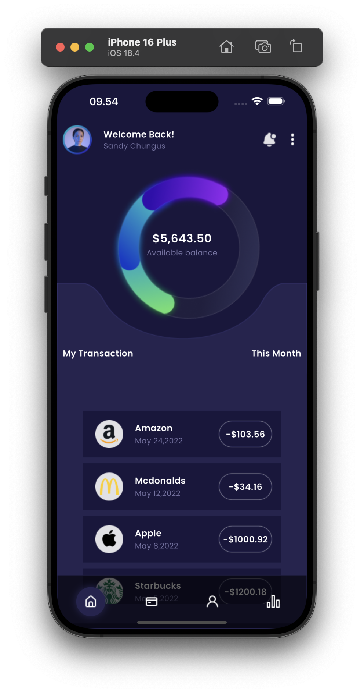
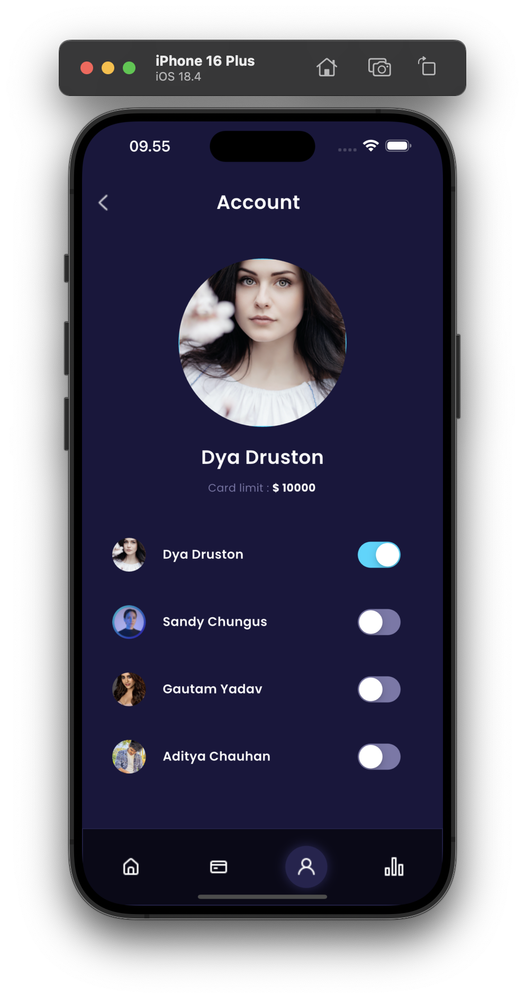
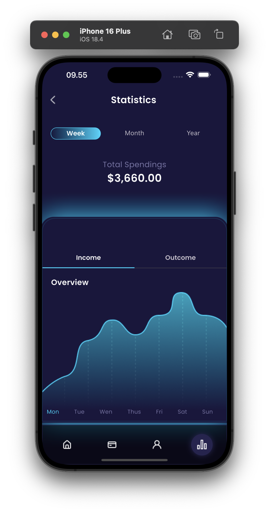
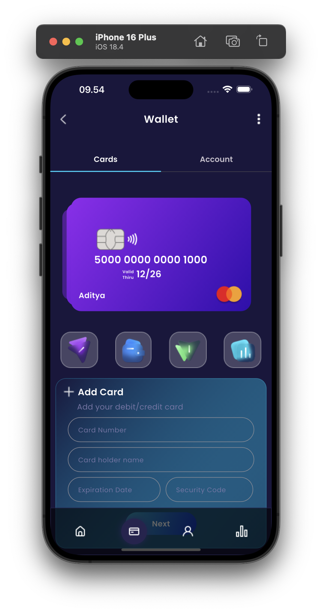

## Project Overview

A sleek and modern mobile wallet application built with Flutter, designed to provide users with a seamless digital payment experience. The application features a dark theme UI with smooth animations and intuitive navigation.

## Problem Statement

Traditional banking and payment methods often lack the convenience and speed that modern users demand. This E-Wallet application aims to bridge this gap by providing a user-friendly, secure, and efficient digital payment solution.

## Target Users / Use Cases

- Mobile users seeking quick and convenient payment solutions
- Individuals looking for a modern digital wallet experience
- Users who prefer dark-themed applications
- People who need to manage their digital transactions on the go

## Tech Stack

- Flutter (Mobile Framework)
- Dart (Programming Language)
- Go Router (Navigation)
- Iconsax (Icon System)
- Card Swiper (UI Component)

## Core Architecture / Methodology

The application follows a clean architecture pattern with:

- Feature-based directory structure
- Router-based navigation
- Widget-based UI components
- Common utilities and shared components

## Project Structure

```
lib/
├── common/         # Shared utilities and constants
├── features/       # Feature-specific implementations
├── router/         # Navigation configuration
├── screen/         # Screen implementations
├── widget/         # Reusable UI components
└── main.dart       # Application entry point
```

## Key Features

- Dark theme UI design
- Smooth card swiping interface
- Modern icon system
- Responsive layout
- Intuitive navigation

## User Interface Design

- Dark theme optimized for reduced eye strain
- Custom Poppins font family integration
- Material Design principles
- Smooth animations and transitions
- Card-based interface for better user experience

## State Management / Logic Flow

- Stateless widget architecture
- Router-based state management
- Clean separation of concerns

## Testing & Validation

- Flutter test framework integration
- Linting rules configured via analysis_options.yaml

## Challenges & Solutions

- Implemented custom navigation using Go Router for better routing control
- Integrated custom font family (Poppins) for consistent typography
- Optimized asset management for better performance

## Performance Metrics / Evaluation

- Debug banner disabled for production-like experience
- Optimized asset loading
- Efficient widget tree structure

## Results & Impact

- Clean and modern user interface
- Smooth navigation experience
- Efficient resource management

## Screenshots / Demo

| Home Screen                         | Account Screen                           |
| ----------------------------------- | ---------------------------------------- |
|  |  |

| Statistic Screen                            | Wallet Screen                         |
| ------------------------------------------- | ------------------------------------- |
|  |  |

## Future Improvements

- Authentication system implementation
- Payment gateway integration
- Transaction history feature
- User profile management
- Push notification system
- Biometric authentication

## Lessons Learned

- Importance of proper project structure
- Value of using modern navigation solutions
- Benefits of custom theming
- Asset management best practices

## Installation & Setup Guide

1. Ensure you have Flutter SDK installed (version >=3.2.0)
2. Clone the repository
3. Run `flutter pub get` to install dependencies
4. Run `flutter run` to start the application

## Credits / Acknowledgments

- Flutter team for the amazing framework
- Iconsax for the icon system
- Card Swiper package contributors
- Go Router team for the navigation solution
