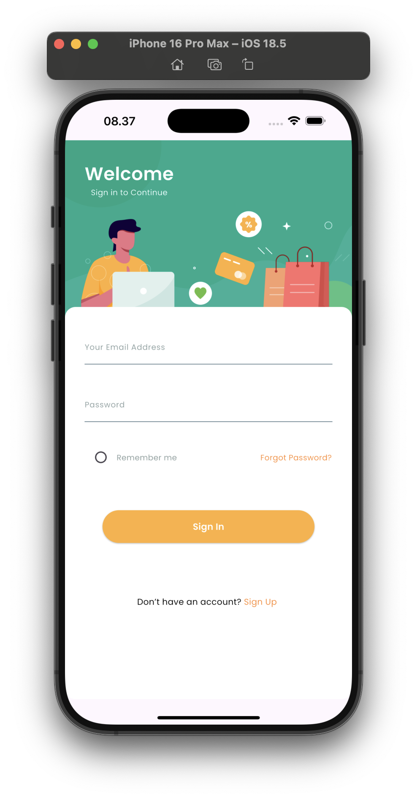
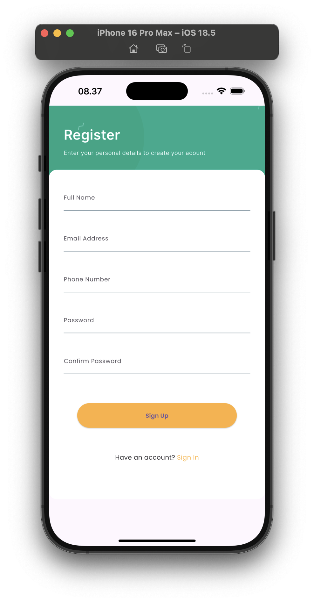
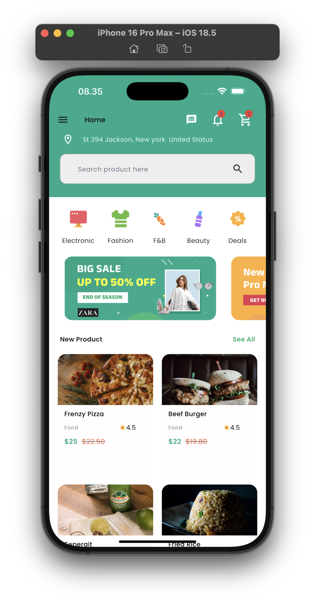
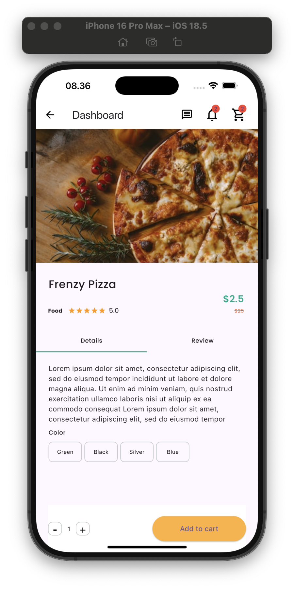
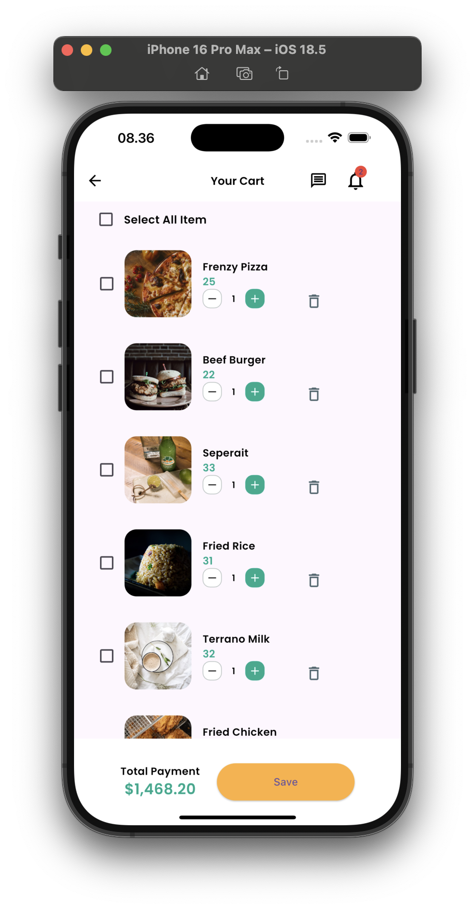
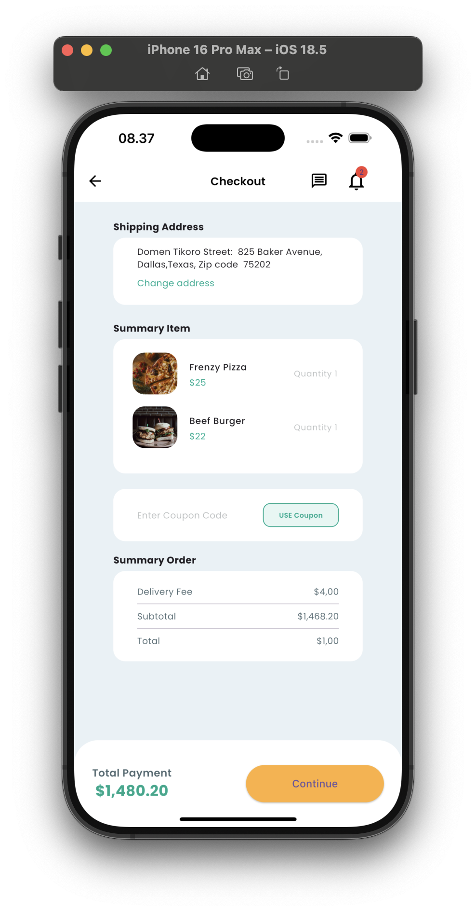

## Project Overview

ShopEase is a modern e-commerce mobile application built with Flutter, offering a seamless shopping experience with a focus on user-friendly interface and smooth navigation. The app implements a complete shopping flow from product browsing to checkout, following modern design principles and best practices in mobile development.

## Problem Statement

Traditional e-commerce apps often suffer from complex navigation, cluttered interfaces, and inefficient checkout processes. ShopEase addresses these issues by providing a streamlined, intuitive shopping experience that prioritizes user engagement and conversion.

## Target Users / Use Cases

- Mobile shoppers looking for a smooth shopping experience
- Users who prefer quick and easy product browsing
- Customers who value clear product information and easy checkout
- Retail businesses seeking to modernize their mobile presence

## Tech Stack

- Flutter (^3.8.0)
- Dart SDK
- Google Fonts
- Material Design
- Cupertino Icons

## Key Features

- User Authentication (Login & Registration)
- Product Browsing and Search
- Detailed Product Views
- Shopping Cart Management
- Secure Checkout Process
- Payment Method Selection
- Responsive Design
- Portrait Mode Optimization

## Project Structure

```
lib/
├── screens/
│   ├── login_screen.dart
│   ├── register_screen.dart
│   ├── home_screen.dart
│   ├── cart_screen.dart
│   ├── detail_screen.dart
│   ├── checkout_screen.dart
│   └── payment_screen.dart
├── services/
├── main.dart
└── core.dart
```

## 📸 Screenshots

| Login Screen                             | Register Screen                                |
| ---------------------------------------- | ---------------------------------------------- |
|  |  |

| Home Screen                            | Product Detail Screen                              |
| -------------------------------------- | -------------------------------------------------- |
|  |  |

| Cart Screen                            | Checkout Screen                                |
| -------------------------------------- | ---------------------------------------------- |
|  |  |

### Authentication Screens

- **Login Screen**: Clean and intuitive login interface with email and password fields
- **Register Screen**: User-friendly registration form with validation

### Main Features

- **Home Screen**: Modern and responsive home screen featuring:

  - Featured products section
  - Category navigation
  - Search functionality
  - Promotional banners

- **Product Detail Screen**: Comprehensive product view including:

  - High-quality product images
  - Detailed product information
  - Price and availability
  - Add to cart functionality

- **Shopping Cart**: Efficient cart management with:

  - Product list with quantities
  - Price calculations
  - Checkout options
  - Product removal capability

- **Checkout Screen**: Streamlined checkout process featuring:
  - Order summary
  - Shipping information
  - Payment method selection
  - Order confirmation

## Implementation Details

### UI/UX Design

- Material Design principles
- Consistent color scheme
- Intuitive navigation
- Responsive layouts

### State Management

- Efficient cart state handling
- User session management
- Product data management

### Performance Optimization

- Optimized image loading
- Smooth screen transitions
- Efficient memory management

## Future Improvements

1. Implement user authentication backend
2. Add product search functionality
3. Integrate payment gateway
4. Add user reviews and ratings
5. Implement wishlist feature
6. Add push notifications
7. Implement dark mode

## Installation & Setup Guide

1. Ensure you have Flutter SDK installed (version ^3.8.0)
2. Clone the repository
3. Run `flutter pub get` to install dependencies
4. Run `flutter run` to start the application

## Credits / Acknowledgments

- Flutter Team for the amazing framework
- Google Fonts for typography
- Material Design team for UI guidelines
